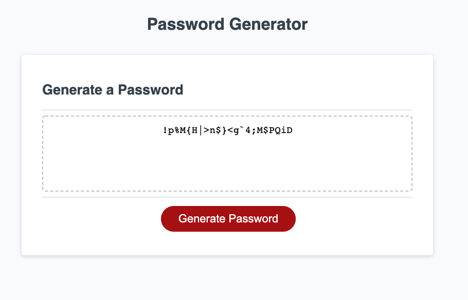

# Password-Generator
 
 ## About
    This password generator will allow user to generate a set of random password with the specific characters the user chose.

### Application
    With pressing on the Generate Password button, user will be asked to insert the wanted lenght of the password, must be from 8-128 characters.
    Next, user will be asked if he/she/they wish to include uppercase, lowercase, numbers, and symbols.
    Finally, the password will be displayed after user completed all the promts. 

    

 ## Characters included:
 **Uppercase**: ABCDEFGHIJKLMNOPQRSTUVWXYZ
 **Lowercase**: abcdefghijklmnopqrstuvwxyz
 **Numbers**: 1234567890
 **Sybmols**: ~!@#$%^&*(){}|:<>?,.'[]\

 ## Completed Website

## Deployed URL
    Try out to get a random password with the link below!
    
    [checkout the link here](https://yingliii.github.io/Password-Generator/)

